# Product vision

Running Coach App, team 4.

## Goal

A beginner to intermediate runner with only a phone hears what to do and how the run is going while they are running, without looking at the screen.

**Supports:** [VP-01](research/value-proposition.md#vp-01).
[VP-02](research/value-proposition.md#vp-02), the preset sessions the coach speaks, builds on it.

## Stakeholders

- **Runner**: a beginner to intermediate runner, often without a sports watch, who runs alone and does not want to look at the phone.
  The primary user.
- **`Customer`**: our instructor, who decides the scope, reacts to the prototype, and accepts or rejects the candidate.
- **The team**: four students who build, review, and submit it, and who are assessed on the process as much as the product.
- **Google Health**: the app the `Customer` already uses.
  He dislikes it for one reason — it makes him stare at stats rather than talk — and it is the comparison he judges us against.
- **Android users outside the team**: the audience the `Customer` wants it to reach if it is published to the Play Store or GitHub.
  They use it, they do not decide it.

## Constraints

### CON-01

The first release targets Android.

- **Status:** Active
- **Source:** Customer-given
- **What it costs:** no iPhone user can run it, and no iOS toolchain, assets, or testing.
  The team writes one platform's code and cannot show a second device.
- **Decision:** [`DEC-006`](decisions.md#dec-006)

### CON-02

The first release is in English.

- **Status:** Active
- **Source:** Customer-given
- **What it costs:** no other language ships, so every spoken string is written once and never localised.
  Russian can follow only if someone does that work later.
- **Decision:** [`DEC-006`](decisions.md#dec-006)

### CON-03

The run is processed on the phone wherever that is possible.

- **Status:** Active
- **Source:** Customer-given
- **What it costs:** no cloud model, so the spoken coach cannot be as capable as a server-side one, and the phone carries the whole compute load while the runner is moving.
- **Decision:** [`DEC-004`](decisions.md#dec-004)

### CON-04

Inputs come from the phone, and from a wearable only when one is already connected.

- **Status:** Active
- **Source:** Customer-given
- **What it costs:** no heart rate without a watch, so the coach speaks time, pace, and distance instead, and intensity has to be judged from motion rather than from the heart.
- **Decision:** [`DEC-002`](decisions.md#dec-002)

### CON-05

No uploads of health or medical documents, and no typed health data.

- **Status:** Active
- **Source:** Customer-given
- **What it costs:** the product cannot ask a runner to rate effort after a run, so the perceived-effort input that [`GAP-02`](research/gap-analysis.md#gap-02) was written around is not available in the first release.
- **Decision:** [`DEC-003`](decisions.md#dec-003)

### CON-06

Built by a team of four inside ten weeks of the course.

- **Status:** Active
- **Source:** Team-given
- **What it costs:** nothing may need a second expert to maintain, and every week's work has to be reviewable in one pull request.

### CON-07

Submission 3, the first working vertical slice, falls due on 15 October 2026.

- **Status:** Active
- **Source:** Environmental
- **What it costs:** the hard deadline is eight days after this one, so a story that slips in Week 2 has to be cut rather than carried.

### CON-08

The team has no sports watch to test against.

- **Status:** Active
- **Source:** Derived
- **What it costs:** [`CON-04`](#con-04) allows a wearable only when one is connected, and none of us can connect one, so a heart-rate path can be written but never demonstrated.

## Boundary

### BND-01

Give a training plan that adapts when a run goes differently from it.

- **Status:** Active
- **Handled by:** Runna (ALT-01) and Garmin Coach (ALT-02)
- **Why:** the `Customer` did not want an adaptive plan. [`GAP-01`](research/gap-analysis.md#gap-01) and [`GAP-03`](research/gap-analysis.md#gap-03) are `Dropped` in [`DEC-007`](decisions.md#dec-007), and [`ASM-07`](assumptions.md#asm-07) confirms the in-run coach is the product.

### BND-02

Explain to the runner why a workout changed.

- **Status:** Active
- **Handled by:** Nobody
- **Why:** there is nothing to explain while [`BND-01`](#bnd-01) holds. [`GAP-01`](research/gap-analysis.md#gap-01) is `Dropped` in [`DEC-007`](decisions.md#dec-007).

### BND-03

Upload health or medical documents, or ask the runner to type health data.

- **Status:** Active
- **Handled by:** Nobody
- **Why:** [`CON-05`](#con-05): the `Customer` judges that users will not do it, per [`DEC-003`](decisions.md#dec-003).

### BND-04

Share a run with a friend, live or afterwards.

- **Status:** Active
- **Handled by:** Nobody
- **Why:** [`DEC-005`](decisions.md#dec-005): connections, security, and sharing between accounts are a project on its own, and he left it open as a later paid tier.

### BND-05

Record runs to a file the runner can take elsewhere, or import a run they recorded elsewhere.

- **Status:** Active
- **Handled by:** The runner, by hand
- **Why:** phone and watch apps already record runs well, so recording is not where any alternative failed; see [the rejected list](research/gap-analysis.md#gaps-we-chose-not-to-pursue).

### BND-06

Coach through a conversational exchange while the runner is moving.

- **Status:** Active
- **Handled by:** Nobody
- **Why:** [`CON-03`](#con-03) keeps the work on the phone. [`ASM-08`](assumptions.md#asm-08) is `Refuted`: [`DEC-008`](decisions.md#dec-008) puts simple spoken questions about the current run's stats inside the product. A general conversation stays outside.

## Context

The runner and their headphones are the actors.
The external systems are the phone sensors, which supply pace, distance, and elapsed time, and a wearable watch, which supplies heart rate only when one is connected.
The headphones are on the diagram because they carry everything the product produces.
The wearable is on the diagram only because [`CON-04`](#con-04) allows it as an optional input.
Nothing else exchanges anything with the product: there is no server, because [`CON-03`](#con-03) keeps the run on the phone, and every job the boundary leaves to nobody is left to nobody here.

## Where The Detail Lives

- [User stories](https://github.com/Running-Coach-App/running-coach-app/issues?q=label%3Auser-story)
- [Week 2 report](../reports/week-02/README.md)
